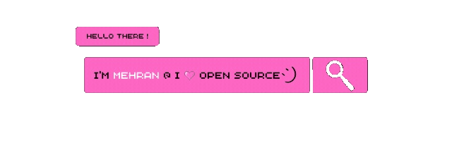

<p align="left"><a href="https://iamehran.github.io"></a>
<p align="center">
</p>
</p>
   
```js
System.out.println("Mehran Firdous");
```

<details>
  <summary>More info</summary>
  <h3 align="center">Here to learn lot of things.

  </h3>
</details>

## ❤️‍🔥Github Stats

| <a href="https://github.com/iamehran/github-readme-stats"></a> | <a href="https://github.com/iamehran/github-readme-stats"></a> |
| ------------- | ------------- |

<!--START_SECTION:activity-->

<!--END_SECTION:activity-->

## 📛Badges
[](https://holopin.io/@iamehran)
<h3 align="center">⚡Find me On⚡</h3>
<p align="center"><a href="https://www.linkedin.com/in/mehran-firdous-78b582207/" target="blank"></a> <a href="https://twitter.com/mehran_firdous">
</a></p>

 <p align="center">
    
</p>


<!-- <a href="https://dev.to/iamehran" target="blank"></a> -->


