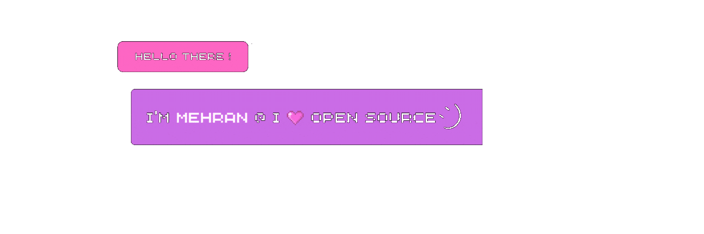

<p align="center"></p>   
<!--  press <kbd>W</kbd> to go up, and <kbd>A</kbd> to go down. -->

```js
System.out.println("Resist Ego, Resist Eco Chambers, Choose to Grow.");
```
</div> 

<p align="left"><a href="https://iamehran.github.io">
</p>

## Skills/Attributes
[](https://git.io/typing-svg)
<details>
  <summary>More info</summary>
 </a> 
</details>

## ❤️‍🔥Github Stats
<a href="https://github.com/iamehran/github-readme-stats"></a> 


## Recent Activity
<!--START_SECTION:activity-->

<!--END_SECTION:activity-->

## 📛Badges
[](https://holopin.io/@iamehran)
<h3 align="center">⚡Find me On⚡</h3>
<p align="center"><a href="https://www.linkedin.com/in/mehran-firdous-78b582207/" target="blank"></a> <a href="https://twitter.com/mehran_firdous">
</a></p>

 <p align="center">
    
</p>


<!-- <a href="https://dev.to/iamehran" target="blank"></a> -->


